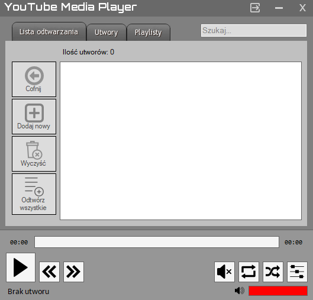
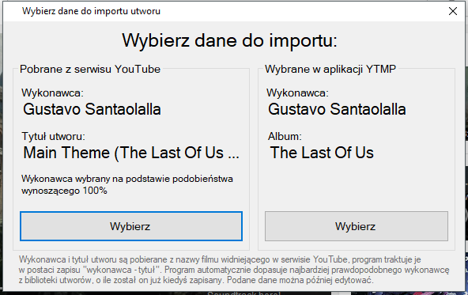
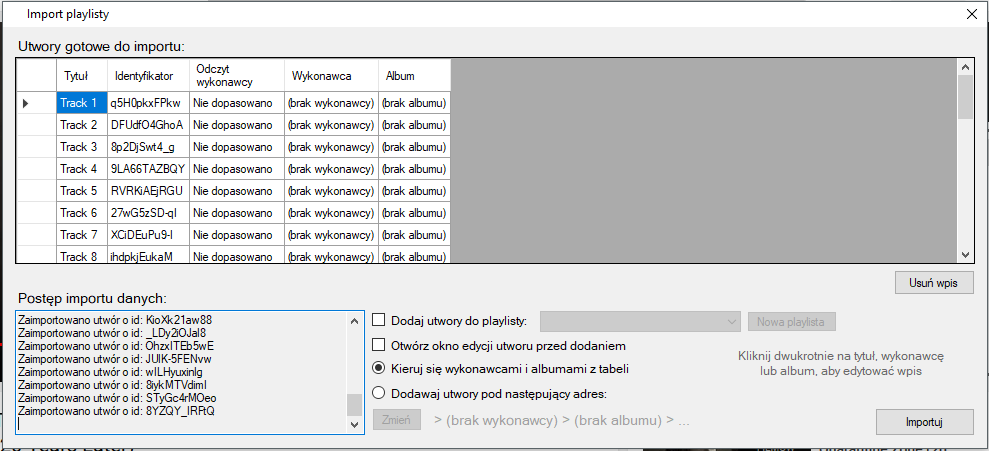
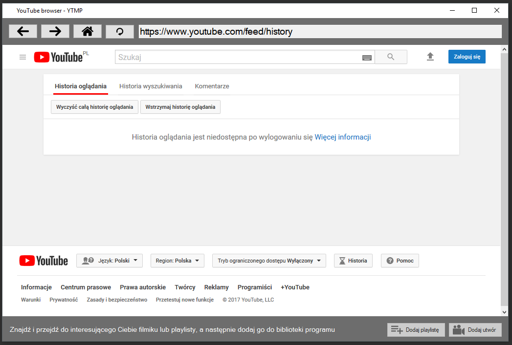
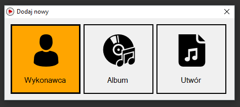
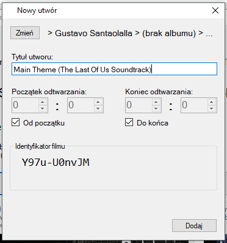
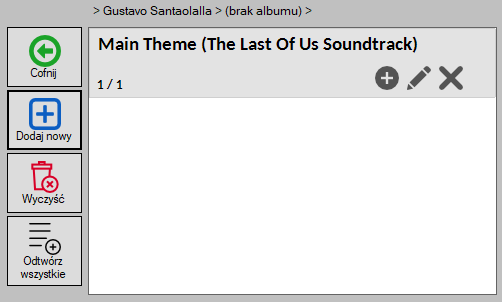
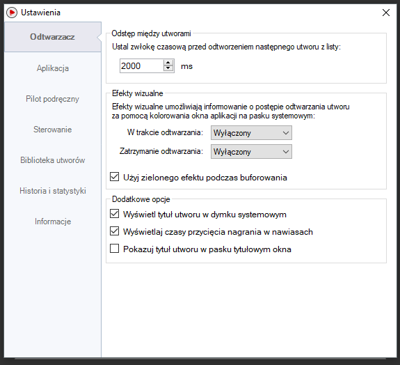
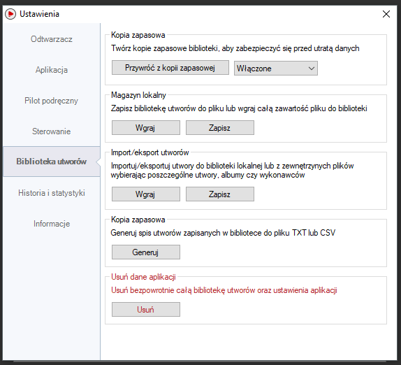

## Opis
Aplikacja służy do strumieniowego odtwarzania muzyki dostępnej w serwisie YouTube. Umożliwia ona szybkie stworzenie własnej, unikalnej biblioteki utworów. Pozycje można uporządkować wg wykonawców oraz albumów w jakich się pojawiły. Aplikacja posiada także możliwość utworzenia włanych predefiniowanych playlist.

</img>

## Integracja z serwisem YouTube
Dzięki zastosowaniu współpracy z serwisem YouTube możliwe jest szybkie i sprawne dodawanie utworów do biblioteki przy pomocy wbudowanej w aplikację przeglądarce www. Wystarczy wskazać film w przeglądarce, a program sam odczyta nazwę wykonawcy i tytuł utworu z nazwy pod jaką film widnieje w serwisie.

</img>

## Import playlist
Aplikacja umożliwia także import playlist stworzonych w serwisie YouTube wraz z automatycznym rozpoznawaniem wykonawcy i przypisaniem ich do odpowiednich list

</img>

## Wbudowana przeglądarka internetowa
Dzięki przeglądarce wbudowanej w aplikację dodawanie utworów do biblioteki jest szybkie i automatyczne!

</img>

## Więcej informacji
Instrukcja obsługi aplikacji znajduje się w katalogu głównym udostępnionym na GitHubie. Zawiera ona dodatowe informacje o działaniu aplikacji i jej obsłudze.

[Otwórz instrukcje PDF](https://github.com/adan2013/YTMP/blob/master/instrukcja.pdf)

## Instalacja i pierwsze uruchomienie
Aby móc uruchomić aplikację należy pobrać jej ostatnią wersję z zakładki "Releases" na GitHubie. Następnie rozpakować ją do folderu np. za pomocą aplikacji WinRAR lub domyślnego narzędzia wbudowanego w system operacyjny. W folderze z rozpakowanymi plikami należy odnaleźć plik "YTMP.exe", a następnie go uruchomić. Przy pierwszym uruchomieniu aplikacja zaproponuje otwarcie instrukcji obsługi. Po zamknięciu okna wprowadzenia aplikacja jest gotowa do działania.

[Otwórz stronę releases](https://github.com/adan2013/YTMP/releases)

## Instalowanie aktualizacji
Od wersji 7.0 aplikacja YTMP jest wyposażona w mechanizm automatycznego pobierania i instalowania aktualizacji z serwisu GitHub. Gdy tylko pojawi się nowsza wersja aplikacja powiadamia użytkownika stosownym komunikatem w oknie odtwarzacza, a następnie przeprowadza przez proces instalacji.

Podczas instalacji aktualizacji nie należy dokonywać ręcznych zmian w plikach aplikacji, a także nie należy próbować uruchamiać odtwarzacza. Może to spowodować zdestabilizowanie procesu instalacji i doprowadzić do uszkodzenia plików. Instalator zamknie aplikację i uruchomi ją ponownie, gry będzie to już możliwe. Ponieważ YTMP nie posiada podpisu cyfrowego, a jego kod aktualizacyjny podmienia pliki wykonywalne istnieje możliwość, iż niektóre programy antywirusowe (zwłaszcza te darmowe) mogą zablokować działanie instalatora, a nawet próbować go usunąć. W tym przypadku należy dodać do wyjątków programu antywirusowego dwa pliki: "YTMP.exe" oraz "YTMP-AUTOUPDATER.exe" lub najlepiej cały katalog z plikami aplikacji.

## Wygląd aplikacji
Ponieżej przedstawiam dodatkowe zrzuty ekranu prezentujące działanie aplikacji:

</img>

</img>

</img>

</img>

</img>